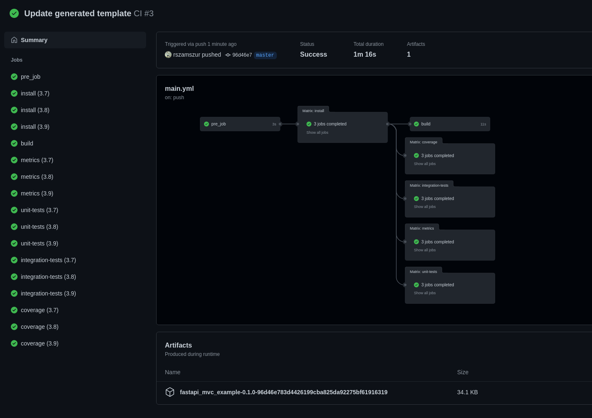

Why fastapi-mvc?
================

What is fastapi-mvc?
--------------------

Fastapi-mvc is a developer productivity tool for `FastAPI <https://fastapi.tiangolo.com/>`__ web framework.
It is designed to make programming `FastAPI <https://fastapi.tiangolo.com/>`__ applications easier by making assumptions about what every developer needs to get started.
It allows you to write less code while accomplishing more. It comes with a number of scripts called generators that are designed to make your development life easier by
creating everything necessary to start working on a particular task.

Fastapi-mvc is opinionated software. It assumes that there is a "best" way to do things, and it's designed to encourage that way - and in some cases, to discourage alternatives.
If you learn "fastapi-mvc way" you'll probably discover a tremendous increase in productivity.
However, suppose you persist in bringing old habits from other languages to your fastapi-mvc development, and trying to use patterns you learned elsewhere.
In that case, you may have a less happy experience.

Motivation
----------

`FastAPI <https://fastapi.tiangolo.com/>`__ is an excellent, modern, fast (high-performance), web framework, but it lacks essential
utilities and generators for the developer, for instance: creating new project structure.

In some podcast (I believe it was one of Kubernetes Podcast from Google) I heard this quote:

"The common denominator in excellent frameworks is that they got people working very quickly on what they're trying to learn, experiment with, or use."

An excellent example of that is Ruby On Rails, you experience success rapidly, but then success merely opens the door to learn the underlying technology you're using and relying upon.

Think of `FastAPI <https://fastapi.tiangolo.com/>`__ + fastapi-mvc as Ruby on Rails, at least that's the goal.

Features
--------

Implemented using MVC architectural pattern
~~~~~~~~~~~~~~~~~~~~~~~~~~~~~~~~~~~~~~~~~~~

Generated project by fastapi-mvc is structured in MVC architectural pattern to help developers who don't know FastAPI yet but are familiar with MVC to get up to speed quickly.

WSGI + ASGI production server
~~~~~~~~~~~~~~~~~~~~~~~~~~~~~

**TLDR;**

Running WSGI as a master worker with ASGI workers gives better results than running pure ASGI:

* better performance (requests per second)
* better support for different protocols
* broader configuration
* better support with using reverse proxy

First of all, whether it's ASGI, WSGI, or combined, think of this as something that serves the application.
For instance, Ruby on Rails uses Puma. The result of any of those servers is a TCP/IP or UNIX socket which is
later on utilized by reverse proxy ex: Nginx (a TCP/IP socket you can access directly over the network, but still in
production, usually it'll be behind a reverse proxy).

Now to WSGI + ASGI part. FastAPI is implemented with `asyncio <https://docs.python.org/3/library/asyncio.html>`__, so having a pure WSGI server doesn't make sense since
you'd lose all the benefits of asynchronous concurrency. That's where ASGI comes in. However, Python journey with
asyncio is still pretty young. Most projects have yet to reach maturity level (you should expect early bugs and a limited feature set).
FastAPI, as ASGI server uses uvicorn, which is still prior 1.x.x release (17 in total so far, current 0.16.0) and lacks support for some protocols (ex: no HTTP/2).
Moreover, some reverse proxy might not know how to work with asynchronous servers, and some problems or early bugs on this layer might happen as well.

I'm not saying uvicorn is bad. Quite contrary, if you'd run 4 pure uvicorn workes, you'd still get great results.
But if you'd run the same amount of workers with gunicorn (WSGI) as a master worker, it turns out you can even pump those numbers up.

Gunicorn with 4 Uvicorn Workers `(source) <https://stackoverflow.com/a/62977786/10566747>`__:

.. code-block:: bash

    Requests per second: 7891.28 [#/sec] (mean)
    Time per request: 126.722 [ms] (mean)
    Time per request: 0.127 [ms] (mean, across all concurrent requests)

Pure Uvicorn with 4 workers:

.. code-block:: bash

    Requests per second: 4359.68 [#/sec] (mean)
    Time per request: 229.375 [ms] (mean)
    Time per request: 0.229 [ms] (mean, across all concurrent requests)

~80% better

I guess gunicorn does a better job in worker management. However, it's a more mature project, so it's probably a matter of time
when uvicorn (or other ASGI for that matter) will catch up to this benchmark.

Last but not least, gunicorn gives a ton of `settings to configure <https://docs.gunicorn.org/en/stable/settings.html>`__, which can come in handy.

Generated project comes with Sphinx documentation and 100% unit tests coverage
~~~~~~~~~~~~~~~~~~~~~~~~~~~~~~~~~~~~~~~~~~~~~~~~~~~~~~~~~~~~~~~~~~~~~~~~~~~~~~

Unit test coverage is at 100% regardless of chosen configuration. There is also a placeholder for integration tests with an example dummy test.
The metrics stage in CI workflow ensures important PEP rules are enforced. For additional readability and formatting checks - black is used.
Every piece of generated code is documented with docstrings. Last but not least Sphinx documentation with API reference is included.

Dockerfile with K8s and cloud in mind
~~~~~~~~~~~~~~~~~~~~~~~~~~~~~~~~~~~~~

Container image features:

* Based on distroless image
* Run as PID 1 (with child processes)
* Utilizes multi-stage build for smallest size possible, also this results in having only necessary libraries/dependencies/tools in outcome container image.
* DigestSHA - immutable identifier instead of tags, for better reproducibility and security.
* Signal handling, for Kubernetes to be able to gracefully shut down pods.
* Created with common layers.
* By default runs as non-root user

Based on `Google Best practices for building containers <https://cloud.google.com/architecture/best-practices-for-building-containers>`__, `Top 20 Dockerfile best practices <https://sysdig.com/blog/dockerfile-best-practices>`__, and own experience.

Extensive GitHub actions for CI
~~~~~~~~~~~~~~~~~~~~~~~~~~~~~~~

Helm chart
~~~~~~~~~~

For easy deployments in Kubernetes cluster.

Kubernetes deployment with HA Redis cluster
~~~~~~~~~~~~~~~~~~~~~~~~~~~~~~~~~~~~~~~~~~~

Application stack in Kubernetes:

.. image:: _static/k8s_arch.png

Uses `Poetry <https://github.com/python-poetry/poetry>`__ dependency management
~~~~~~~~~~~~~~~~~~~~~~~~~~~~~~~~~~~~~~~~~~~~~~~~~~~~~~~~~~~~~~~~~~~~~~~~~~~~~~~

Poetry comes with all the tools you might need to manage your project in a deterministic way. Moreover, it's based on new unified Python project settings file - `PEP 518 <https://www.python.org/dev/peps/pep-0518/>`__ that replaces setup.py.

Reproducible virtualized development environment
~~~~~~~~~~~~~~~~~~~~~~~~~~~~~~~~~~~~~~~~~~~~~~~~

Easily boot virtual machine with Vagrant. Code and test straight away.

*Note: Project directory is rsync'ed between Host and Guest.*

*Note2: provided Vagrant vm doesn't have port forwarding configured which means, that application won't be accessible on Host OS.*

Builtin utilities
~~~~~~~~~~~~~~~~~

For your discretion, I've provided some basic utilities:

* RedisClient ``.app.utils.redis``
* AiohttpClient ``.app.utils.aiohttp_client``

They're initialized in ``asgi.py`` on FastAPI startup event handler, and are available for whole application scope without passing object instances between controllers.

Configurable from env
~~~~~~~~~~~~~~~~~~~~~

Generated application provides flexibility of configuration. All significant settings are defined by the environment variables, each with the default value.

Roadmap
-------

Feature roadmap can be found `here <https://github.com/rszamszur/fastapi-mvc/issues/53>`__.
