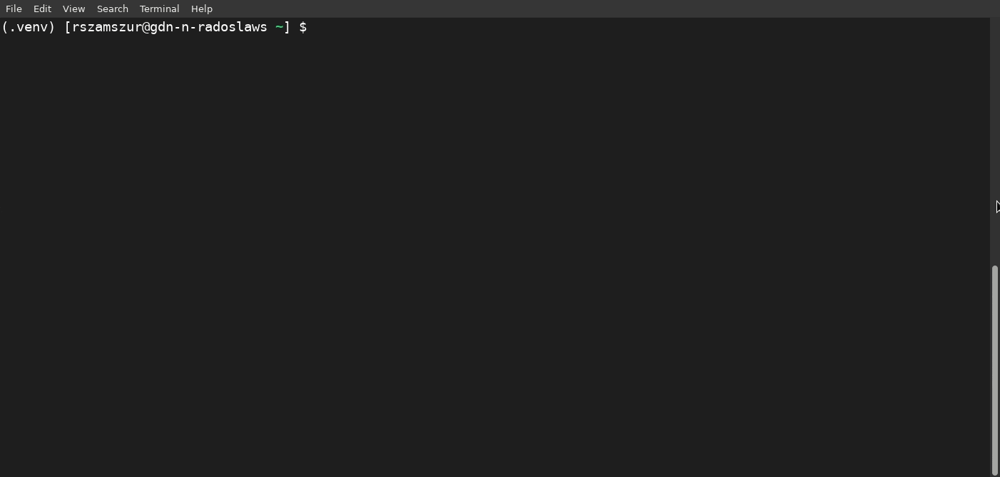

Welcome to fastapi-mvc
======================

--------------

.. image:: https://github.com/rszamszur/fastapi-mvc/actions/workflows/main.yml/badge.svg?branch=master
   :target: https://github.com/rszamszur/fastapi-mvc/actions/workflows/main.yml

.. image:: https://github.com/rszamszur/fastapi-mvc/actions/workflows/integration.yml/badge.svg?branch=master
   :target: https://github.com/rszamszur/fastapi-mvc/actions/workflows/integration.yml

.. image:: https://codecov.io/gh/rszamszur/fastapi-mvc/branch/master/graph/badge.svg?token=7ESV30TYZS
    :target: https://codecov.io/gh/rszamszur/fastapi-mvc

.. image:: https://img.shields.io/pypi/v/fastapi-mvc
    :alt: PyPI

.. image:: https://img.shields.io/pypi/dm/fastapi-mvc
    :alt: PyPI - Downloads

.. image:: https://img.shields.io/pypi/pyversions/fastapi-mvc
    :alt: PyPI - Python Version

.. image:: https://img.shields.io/badge/code%20style-black-000000.svg
    :target: https://github.com/psf/black

**Example generated project:** `https://github.com/rszamszur/fastapi-mvc-example <https://github.com/rszamszur/fastapi-mvc-example>`__

--------------

Create and develop production grade FastaAPI projects, based on MVC architectural pattern, WSGI + ASGI.
Includes tests, GitHub actions, utilities, Helm, Dockerfile, Makefile, and more.

Creating a new FastAPI project is as easy as:

.. code-block:: bash

    fastapi-mvc new my-project

To run development uvicorn server:

.. code-block:: bash

    cd my-project
    fastapi-mvc run

To run production WSGI + ASGI server:

.. code-block:: bash

    cd my-project
    poetry run my-project serve
    # or if project virtualenv PATH is set
    my-project serve

To confirm it's working:

.. code-block:: bash

    curl localhost:8000/api/ready
    {"status":"ok"}

You can get the project directly from PyPI:

.. code-block:: bash

    pip install fastapi-mvc

Documentation
-------------

This part of the documentation guides you through all of the features and usage.

.. toctree::
   :maxdepth: 2

   features
   quickstart
   create
   development
   configuration
   deployment

API Reference
-------------

If you are looking for information on a specific function, class, or
method, this part of the documentation is for you.

.. toctree::
   :maxdepth: 2

   api

Miscellaneous Pages
-------------------

.. toctree::
   :maxdepth: 2

   CONTRIBUTING.md
   license
   CHANGELOG.md
