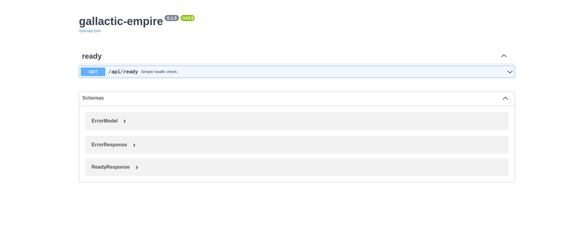

Quickstart
==========

Installation
------------

From PyPi:
~~~~~~~~~~

To install fastapi-mvc from PyPi use ``pip install`` command:

.. code-block:: bash

    pip install fastapi-mvc

To verify that you have everything installed correctly, you should be able to run the following in a new terminal:

.. code-block:: bash

    fastapi-mvc --help

From source with Poetry:
~~~~~~~~~~~~~~~~~~~~~~~~

Prerequisites:

* Python 3.8 or later `(How to install python) <https://docs.python-guide.org/starting/installation/>`__
* make
* git 2.27 or later
* (optional) curl
* (optional) Poetry `(How to install poetry) <https://python-poetry.org/docs/#installation>`__

To install fastapi-mvc from source first clone the repository and use ``make install`` target:

.. code-block:: bash

    git clone https://github.com/fastapi-mvc/fastapi-mvc.git
    cd fastapi-mvc
    make install

By default ``make install`` target will search first for ``python3`` then ``python`` executable in your ``PATH``.
If needed this can be overridden by ``PYTHON`` environment variable.

.. code-block:: bash

    export PYTHON=/path/to/my/python
    make install

Lastly if Poetry is not found in its default installation directory (${HOME}/.local/share/pypoetry) this target will install it for you.
However, one can always point to existing/customize Poetry installation with `environment variables <https://python-poetry.org/docs/configuration/#using-environment-variables>`__:

.. code-block:: bash

    export POETRY_HOME=/custom/poetry/path
    export POETRY_CACHE_DIR=/custom/poetry/path/cache
    export POETRY_VIRTUALENVS_IN_PROJECT=true
    make install

Or using Poetry directly, should you choose:

.. code-block:: bash

    poetry install

From source with `Nix <https://nixos.org/>`__
~~~~~~~~~~~~~~~~~~~~~~~~~~~~~~~~~~~~~~~~~~~~~

Prerequisites:

* Nix 2.8.x or later installed `(How to install Nix) <https://nixos.org/download.html>`__

First configure Nix channel if needed:

.. code-block:: bash

    nix-channel --add https://nixos.org/channels/nixos-22.05
    nix-channel --update

Next install make via Nix:

.. code-block:: bash

    nix-env --install gnumake
    # If you do not want to install make to your profile, one can always use it ad-hoc via nix-shell
    nix-shell -p gnumake

Lastly, use ``make install`` target:

.. code-block:: bash

    git clone https://github.com/fastapi-mvc/fastapi-mvc.git
    cd fastapi-mvc
    make install
    # Or
    nix-shell -p gnumake --run "make install"

Or using Nix directly, should you choose:

.. code-block:: bash

    nix-build -E 'with import <nixpkgs> { overlays = [ (import ./overlay.nix) ]; }; callPackage ./editable.nix {python = pkgs.python310; poetry2nix = pkgs.poetry2nix;}'

Creating a new project
----------------------

Fastapi-mvc comes with a number of scripts called generators that are designed to make your development life easier by creating everything that's necessary to start working on a particular task.
One of these is the new application generator, which will provide you with the foundation of a fresh `FastAPI <https://fastapi.tiangolo.com/>`__ application so that you don't have to write it yourself.

To use this generator, open a terminal and run:

.. code-block:: bash

    $ fastapi-mvc new /tmp/galactic-empire
    🎤 What's your project name?
    Do not use dots or spaces in the name; just "A-Za-z0-9-_" please.
       galactic-empire
    🎤 What is the project repository URL?
       https://your.repo.url.here
    🎤 What is the project container image name?
       galactic-empire
    🎤 What is the project CLI entrypoint name?
       galactic-empire
    🎤 What is the project Helm chart name?
       galactic-empire
    🎤 Tell me who you are.
       Radosław Szamszur
    🎤 Tell me your email.
       radoslawszamszur@gmail.com
    🎤 What is the project description?
       This project was generated with fastapi-mvc.
    🎤 What is the project initial version?
       0.1.0
    🎤 Do you want to include Redis utilities and Kubernetes deployment?
       Yes
    🎤 Do you want to include Helm chart for the project?
       Yes
    🎤 Do you want to include GitHub actions?
       Yes
    🎤 Do you want to include Nix expression files?
       Yes
    🎤 Do you want to include aiohttp utility?
       Yes
    🎤 What is your project license?
       MIT
    🎤 What is your project copyright date?
       2022

    Copying from template version 0.1.0
        create  .
        create  galactic_empire
        create  galactic_empire/wsgi.py
        create  galactic_empire/version.py
        create  galactic_empire/config
        create  galactic_empire/config/redis.py
        create  galactic_empire/config/gunicorn.py
        create  galactic_empire/config/application.py
        create  galactic_empire/config/__init__.py
        create  galactic_empire/cli
        create  galactic_empire/cli/utils.py
        create  galactic_empire/cli/serve.py
        create  galactic_empire/cli/cli.py
        create  galactic_empire/cli/__init__.py
        create  galactic_empire/app
        create  galactic_empire/app/views
        create  galactic_empire/app/views/ready.py
        create  galactic_empire/app/views/error.py
        create  galactic_empire/app/views/__init__.py
        create  galactic_empire/app/utils
        create  galactic_empire/app/utils/redis.py
        create  galactic_empire/app/utils/aiohttp_client.py
        create  galactic_empire/app/utils/__init__.py
        create  galactic_empire/app/router.py
        create  galactic_empire/app/models
        create  galactic_empire/app/models/__init__.py
        create  galactic_empire/app/exceptions
        create  galactic_empire/app/exceptions/http.py
        create  galactic_empire/app/exceptions/__init__.py
        create  galactic_empire/app/controllers
        create  galactic_empire/app/controllers/ready.py
        create  galactic_empire/app/controllers/__init__.py
        create  galactic_empire/app/asgi.py
        create  galactic_empire/app/__init__.py
        create  galactic_empire/__main__.py
        create  galactic_empire/__init__.py
        create  .fastapi-mvc.yml
        create  manifests
        create  manifests/persistent-storage-no-pvc-deletion.yaml
        create  manifests/all-redis-operator-resources.yaml
        create  shell.nix
        create  overlay.nix
        create  image.nix
        create  editable.nix
        create  Nix.mk
        create  charts
        create  charts/galactic-empire
        create  charts/galactic-empire/values.yaml
        create  charts/galactic-empire/templates
        create  charts/galactic-empire/templates/tests
        create  charts/galactic-empire/templates/tests/test-connection.yaml
        create  charts/galactic-empire/templates/serviceaccount.yaml
        create  charts/galactic-empire/templates/service.yaml
        create  charts/galactic-empire/templates/ingress.yaml
        create  charts/galactic-empire/templates/hpa.yaml
        create  charts/galactic-empire/templates/deployment.yaml
        create  charts/galactic-empire/templates/configmap.yml
        create  charts/galactic-empire/templates/_helpers.tpl
        create  charts/galactic-empire/templates/NOTES.txt
        create  charts/galactic-empire/README.md
        create  charts/galactic-empire/Chart.yaml
        create  charts/galactic-empire/.helmignore
        create  .github
        create  .github/workflows
        create  .github/workflows/nix.yml
        create  .github/workflows/integration.yml
        create  .github/workflows/main.yml
        create  .github/workflows/docs.yml
        create  .github/dependabot.yml
        create  tests
        create  tests/unit
        create  tests/unit/test_wsgi.py
        create  tests/unit/cli
        create  tests/unit/cli/test_utils.py
        create  tests/unit/cli/test_serve.py
        create  tests/unit/cli/test_cli.py
        create  tests/unit/cli/conftest.py
        create  tests/unit/cli/__init__.py
        create  tests/unit/app
        create  tests/unit/app/views
        create  tests/unit/app/views/test_ready.py
        create  tests/unit/app/views/test_error.py
        create  tests/unit/app/views/__init__.py
        create  tests/unit/app/utils
        create  tests/unit/app/utils/test_redis.py
        create  tests/unit/app/utils/test_aiohttp_client.py
        create  tests/unit/app/utils/__init__.py
        create  tests/unit/app/test_asgi.py
        create  tests/unit/app/models
        create  tests/unit/app/models/__init__.py
        create  tests/unit/app/exceptions
        create  tests/unit/app/exceptions/test_http.py
        create  tests/unit/app/exceptions/__init__.py
        create  tests/unit/app/controllers
        create  tests/unit/app/controllers/test_ready.py
        create  tests/unit/app/controllers/__init__.py
        create  tests/unit/app/conftest.py
        create  tests/unit/app/__init__.py
        create  tests/unit/__init__.py
        create  tests/integration
        create  tests/integration/test_ready_endpoint.py
        create  tests/integration/__init__.py
        create  tests/__init__.py
        create  pyproject.toml
        create  docs
        create  docs/nix.rst
        create  docs/usage.rst
        create  docs/license.rst
        create  docs/install.rst
        create  docs/index.rst
        create  docs/deployment.rst
        create  docs/conf.py
        create  docs/api.rst
        create  docs/_static
        create  docs/_static/logo.png
        create  default.nix
        create  build
        create  build/dev-env.sh
        create  build/install.sh
        create  build/image.sh
        create  Vagrantfile
        create  TAG
        create  README.md
        create  Poetry.mk
        create  Makefile
        create  LICENSE
        create  Dockerfile
        create  CHANGELOG.md
        create  .gitignore
        create  .dockerignore
        create  .coveragerc

     > Running task 1 of 1: ln -srf CHANGELOG.md docs/CHANGELOG.md

           run  make install
    [install] Begin installing project.
    Creating virtualenv galactic-empire in /tmp/galactic-empire/.venv
    Updating dependencies
    Resolving dependencies... (0.7s)

    Writing lock file

    Package operations: 75 installs, 0 updates, 0 removals

      • Installing certifi (2022.9.24)
      • Installing charset-normalizer (2.1.1)
      • Installing frozenlist (1.3.1)
      • Installing idna (3.4)
      • Installing markupsafe (2.1.1)
      • Installing mdurl (0.1.2)
      • Installing multidict (6.0.2)
      • Installing pyparsing (3.0.9)
      • Installing pytz (2022.4)
      • Installing sniffio (1.3.0)
      • Installing urllib3 (1.26.12)
      • Installing zipp (3.9.0)
      • Installing aiosignal (1.2.0)
      • Installing alabaster (0.7.12)
      • Installing anyio (3.6.1)
      • Installing async-timeout (4.0.2)
      • Installing attrs (22.1.0)
      • Installing babel (2.10.3)
      • Installing docutils (0.19)
      • Installing imagesize (1.4.1)
      • Installing importlib-metadata (5.0.0)
      • Installing iniconfig (1.1.1)
      • Installing jinja2 (3.1.2)
      • Installing markdown-it-py (2.1.0)
      • Installing mccabe (0.7.0)
      • Installing packaging (21.3)
      • Installing pluggy (1.0.0)
      • Installing py (1.11.0)
      • Installing pycodestyle (2.9.1)
      • Installing pyflakes (2.5.0)
      • Installing pygments (2.13.0)
      • Installing requests (2.28.1)
      • Installing snowballstemmer (2.2.0)
      • Installing sphinxcontrib-applehelp (1.0.2)
      • Installing sphinxcontrib-devhelp (1.0.2)
      • Installing sphinxcontrib-jsmath (1.0.1)
      • Installing sphinxcontrib-htmlhelp (2.0.0)
      • Installing sphinxcontrib-serializinghtml (1.1.5)
      • Installing sphinxcontrib-qthelp (1.0.3)
      • Installing tomli (2.0.1)
      • Installing typing-extensions (4.4.0)
      • Installing yarl (1.8.1)
      • Installing aiohttp (3.8.3)
      • Installing click (8.1.3)
      • Installing coverage (6.5.0)
      • Installing flake8 (5.0.4)
      • Installing h11 (0.14.0)
      • Installing httptools (0.5.0)
      • Installing mdit-py-plugins (0.3.1)
      • Installing mypy-extensions (0.4.3)
      • Installing pathspec (0.10.1)
      • Installing platformdirs (2.5.2)
      • Installing pydantic (1.10.2)
      • Installing pydocstyle (6.1.1)
      • Installing pytest (7.1.3)
      • Installing python-dotenv (0.21.0)
      • Installing pyyaml (6.0)
      • Installing sphinx (5.2.3)
      • Installing starlette (0.20.4)
      • Installing uvloop (0.17.0)
      • Installing watchfiles (0.17.0)
      • Installing websockets (10.3)
      • Installing aioredis (2.0.1)
      • Installing aioresponses (0.7.3)
      • Installing black (22.8.0)
      • Installing fastapi (0.85.0)
      • Installing flake8-docstrings (1.6.0)
      • Installing flake8-import-order (0.18.1)
      • Installing flake8-todo (0.7)
      • Installing gunicorn (20.1.0)
      • Installing myst-parser (0.18.1)
      • Installing pallets-sphinx-themes (2.0.2)
      • Installing pytest-asyncio (0.19.0)
      • Installing pytest-cov (4.0.0)
      • Installing uvicorn (0.18.3)

    Installing the current project: galactic-empire (0.1.0)
    Project successfully installed.
    To activate virtualenv run: $ poetry shell
    Now you should access CLI script: $ galactic-empire --help
    Alternatively you can access CLI script via poetry run: $ poetry run galactic-empire --help
    To deactivate virtualenv simply type: $ deactivate
    To activate shell completion:
     - for bash: $ echo 'eval "$(_GALACTIC_EMPIRE_COMPLETE=source_bash galactic-empire)' >> ~/.bashrc
     - for zsh: $ echo 'eval "$(_GALACTIC_EMPIRE_COMPLETE=source_zsh galactic-empire)' >> ~/.zshrc
     - for fish: $ echo 'eval "$(_GALACTIC_EMPIRE_COMPLETE=source_fish galactic-empire)' >> ~/.config/fish/completions/galactic-empire.fish

This will create a fastapi-mvc project called galactic-empire in a ``/tmp/galactic-empire`` directory and install its dependencies using ``make install``.

After you create the application, switch to its folder:

.. code-block:: bash

    $ cd /tmp/galactic-empire

The galactic-empire directory will have a number of generated files and folders that make up the structure of a fastapi-mvc application.
Here's a basic rundown on the function of each of the files and folders that fastapi-mvc creates by default:

.. code-block:: bash

    ├── .github
    │   └── workflows                GitHub Actions definition
    ├── build                        Makefile scripts
    ├── charts                       Helm chart for application
    │   └── galactic-empire
    ├── galactic_empire              Python project root
    │   ├── app                      FastAPI core implementation
    │   │   ├── controllers          Application controllers
    │   │   ├── exceptions           Application custom exceptions
    │   │   ├── models               Application models
    │   │   ├── utils                Application utilities
    │   │   ├── router.py            Application root APIRouter
    │   │   └── asgi.py              Application ASGI node implementation
    │   ├── cli                      Application CLI implementation
    │   ├── config                   Configuration submodule
    │   │   ├── application.py       Application configuration
    │   │   ├── gunicorn.py          Gunicorn configuration
    │   │   └── redis.py             Redis configuration
    │   ├── version.py               Application version
    │   └── wsgi.py                  Application WSGI master node implementation
    ├── manifests                    Manifests for spotathome/redis-operator
    ├── tests
    │   ├── integration              Integration test implementation
    │   ├── unit                     Unit tests implementation
    ├── CHANGELOG.md
    ├── Dockerfile                   Dockerfile definition
    ├── .dockerignore
    ├── .coveragerc
    ├── .gitignore
    ├── fastapi-mvc.ini              Fastapi-mvc application configuration.
    ├── shell.nix                    Development environment Nix expression file.
    ├── overlay.nix                  Set of Nix overlays to extend and change nixpkgs.
    ├── default.nix                  Python project Nix expression file.
    ├── editable.nix                 Editable Python project Nix expression file.
    ├── image.nix                    Container image Nix expression file.
    ├── LICENSE
    ├── Makefile                     Makefile definition
    ├── Poetry.mk                    Sub Makefile containing targets for Poetry
    ├── Nix.mk                       Sub Makefile containing targets for Nix
    ├── poetry.lock                  Poetry dependency management lock file
    ├── pyproject.toml               PEP 518 - The build system dependencies
    ├── README.md
    ├── TAG                          Application version for build systems
    └── Vagrantfile                  Virtualized environment definition

Overriding default template
~~~~~~~~~~~~~~~~~~~~~~~~~~~

If needed one can always override `default fastapi-mvc new project template <https://github.com/fastapi-mvc/cookiecutter>`__. For that use case ``fastapi-mvc new`` command comes with the following CLI options:

* ``--use-version`` - The branch, tag or commit ID to checkout
* ``--use-repo`` - Overrides fastapi-mvc copier-project repository.

Examples:

.. code-block:: bash

    # Use default template from specific version (tag)
    fastapi-mvc new --use-version 0.1.0 /tmp/galactic-empire
    # Use default template from specific commit
    fastapi-mvc new --use-version 519ce9f23dbef378bf958d2463171930feab6dc2 /tmp/galactic-empire

    # Completely overrides template remote
    fastapi-mvc new --use-repo https://github.com/johndoe/my-copier-project.git /tmp/galactic-empire

Hello, World!
-------------

To begin with, let's get some text up on screen quickly. To do this, you need to get your uvicorn development server running.

Starting up the Web Server
~~~~~~~~~~~~~~~~~~~~~~~~~~

You actually have a functional FastAPI application already. To see it, you need to start a web server on your development machine.
You can do this by running the following command in the galactic-empire directory:

.. code-block:: bash

    $ fastapi-mvc run
    INFO:     Will watch for changes in these directories: ['/tmp/galactic-empire']
    INFO:     Uvicorn running on http://127.0.0.1:8000 (Press CTRL+C to quit)
    INFO:     Started reloader process [4039270] using WatchFiles
    INFO:     Started server process [4039305]
    INFO:     Waiting for application startup.
    INFO:     Application startup complete.
    ^CINFO:     Shutting down
    INFO:     Waiting for application shutdown.
    INFO:     Application shutdown complete.
    INFO:     Finished server process [4039305]

This will start up `uvicron <https://github.com/encode/uvicorn>`__ development server (ASGI) distributed with fastapi-mvc by default.
To see your application in action, open a browser window and navigate to http://127.0.0.1:8000. You should see the FastAPI interactive API documentation page:

When you want to stop the web server, hit Ctrl+C in the terminal window where it's running.
When using uvicorn development server, you don't need to restart the it; changes you make in files will be automatically picked up by the uvicorn.

The FastAPI documentation page is the smoke test for a new fastapi-mvc application: it makes sure that you have your software configured correctly enough to serve a page.

You can also check application health by running GET request to ``/api/ready`` endpoint:

.. code-block:: bash

    $ curl 127.0.0.1:8000/api/ready
    {"status":"ok"}

Creating new endpoint
---------------------

To create new endpoint, you need to create at minimum a route and controller with a method.
Lets say we want to create ``death_star`` controller with following endpoints:

* status (GET)
* load (POST)
* fire (DELETE)

For that we will run the controller generator:

.. code-block:: bash

    $ fastapi-mvc generate controller death_star status load:post fire:delete

This will do several things for you:

* Create controller: galactic_empire/app/controllers/death_star.py
* Create unit test: tests/unit/app/controllers/test_death_star.py
* Add router entry in: galactic_empire/config/router.py

The most important of these is the controller file, ``galactic_empire/app/controllers/death_star.py``.
Let's take a look at it:

.. code-block:: python

    """Death star controller implementation."""
    import logging

    from fastapi import APIRouter

    router = APIRouter(
        prefix="/death_star"
    )
    log = logging.getLogger(__name__)

    @router.get(
        "/status",
        status_code=200,
        # Decorator options:
        # https://fastapi.tiangolo.com/tutorial/path-operation-configuration/
    )
    async def status():
        # Implement endpoint logic here.
        return {"hello": "world"}

    @router.post(
        "/load",
        status_code=200,
        # Decorator options:
        # https://fastapi.tiangolo.com/tutorial/path-operation-configuration/
    )
    async def load():
        # Implement endpoint logic here.
        return {"hello": "world"}

    @router.delete(
        "/fire",
        status_code=200,
        # Decorator options:
        # https://fastapi.tiangolo.com/tutorial/path-operation-configuration/
    )
    async def fire():
        # Implement endpoint logic here.
        return {"hello": "world"}

Endpoints are just methods with ``FastAPI path decorator`` aggregated in one file that makes a controller.
For more information please refer to FastAPI documentation, some useful links:

* `create-a-path-operation <https://fastapi.tiangolo.com/tutorial/first-steps/#step-3-create-a-path-operation>`__
* `path params <https://fastapi.tiangolo.com/tutorial/path-params/>`__
* `path-operation-configuration <https://fastapi.tiangolo.com/tutorial/path-operation-configuration/>`__

Now let's look at router configuration:

.. code-block:: python
    :emphasize-lines: 6, 12

    """Application routes configuration.

    In this file all application endpoints are being defined.
    """
    from fastapi import APIRouter
    from galactic_empire.app.controllers import death_star
    from galactic_empire.app.controllers.api.v1 import ready

    router = APIRouter(prefix="/api")

    router.include_router(ready.router, tags=["ready"])
    router.include_router(death_star.router)

As you can see controller generator automatically added FastAPI router entries for you.
You can always disable this behaviour by running with the ``--skip-routes`` option.

Lastly let's try if our new endpoints actually work:

.. code-block:: bash

    $ curl 127.0.0.1:8000/api/death_star/status
    {"hello":"world"}
    $ curl -X POST 127.0.0.1:8000/api/death_star/load
    {"hello":"world"}
    $ curl -X DELETE 127.0.0.1:8000/api/death_star/fire
    {"hello":"world"}

As you can see fastapi-mvc is just a tool designed to make your FastAPI development life easier, by creating everything that's necessary to start working on a particular task.
However, generated project by fastapi-mvc is fully independent and does not require it in order to work. You can learn more about it from included documentation in it.
